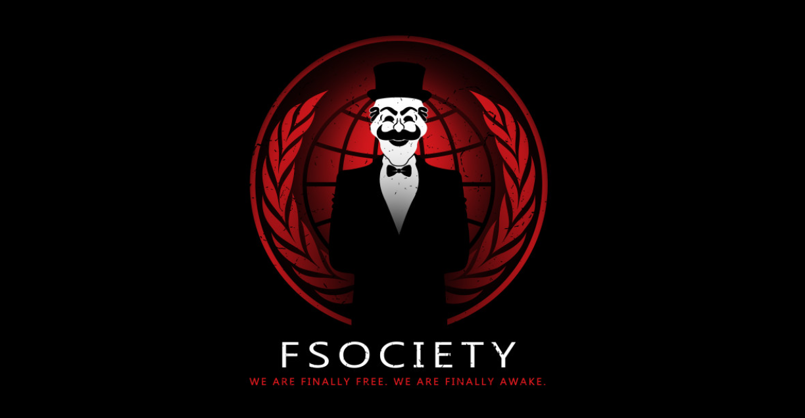

# FSociety

A VS Code theme built in the spirit of those who expose the truth.

**From Mr. Robot's FSociety to your terminal. Pure black. Red accents. No distractions.**

---

## The Theme

Built for those who live in the dark. A pitch-black backdrop that disappears when you start typing, and strategic red accents that guide your focus to what truly matters. Like the group that changed the game, this theme strips away the noise.

### What You Get:

- **Pure Black** as the base – no gray, no distractions
- **Red Accents** where they count: Find widget, focus states, active selections
- **Clear Code Colors** in different red shades, with green as the only accent for maximum readability
- **Full UI Coverage** – tabs, panels, status bar, suggest widget, everything considered
- **Cascadia Code** as default – clean, thin, pleasant to write with

---

## A Look Inside

---

## Installation

Super simple:

1. Open VS Code
2. Go to Extensions (Ctrl+Shift+X / Cmd+Shift+X)
3. Search for "FSociety"
4. Click Install
5. Open "Preferences: Color Theme" and select it

Done.

---

## Font & Defaults

The theme comes with solid defaults so everything looks right out of the box:

- **Primary Font:** Cascadia Code (clean, legible, pleasant)
- **Fallbacks:** JetBrains Mono, Fira Code, Consolas
- **Font Weight:** 400 (not too heavy)
- **Ligatures:** Enabled
- **Font Size:** 14pt (standard, customizable)

If you have your own font settings saved in VS Code, those take priority. The defaults are just a recommendation.

---

## License

MIT. Do what you want with it.

---

**FSociety** – For those who code in the shadows. We are FSociety.

---

## Keywords for Discovery

*dark theme, black background, red accents, hacker aesthetic, cyberpunk, minimalist, syntax highlighting, productivity, focus, clean code, coding theme, FSociety*
